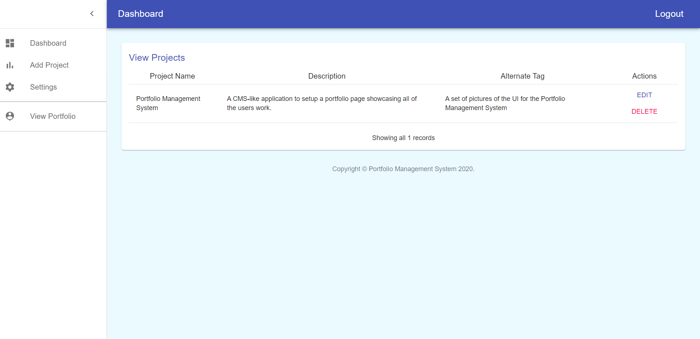
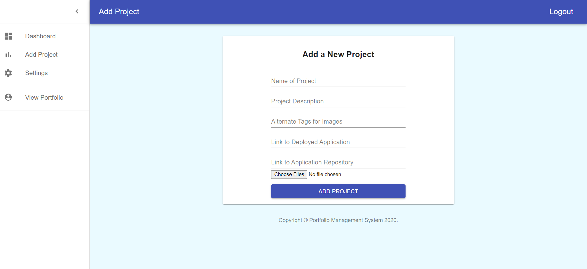
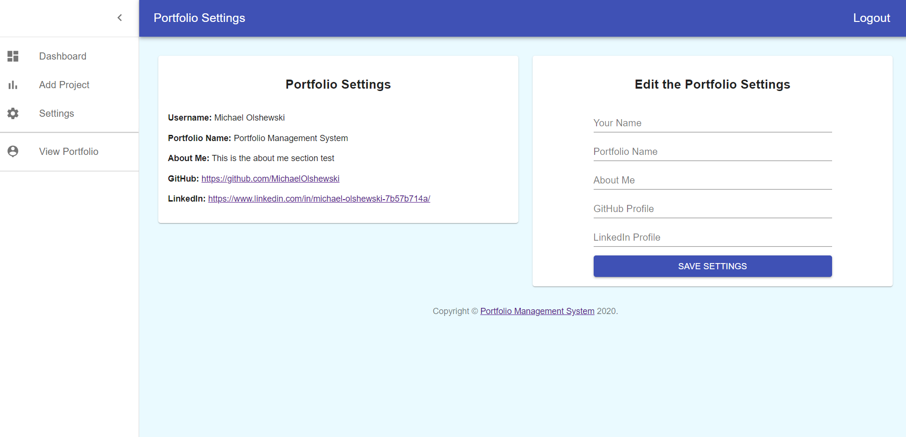
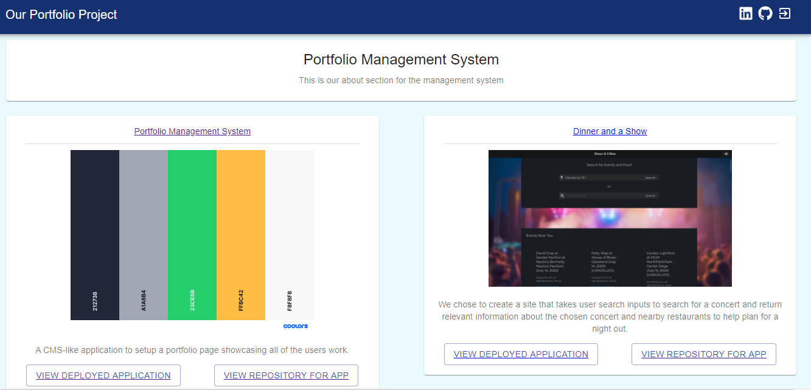

# __*PortfolioManagementSystem*__
[](https://opensource.org/licenses/MIT)
## __License__
MIT

## __Description__
This was the final group project to build a full-stack application. This is a web app that the user can set up the public page with their own UI design, or use the basic one given to house their work, experience and showcase their skills. The portfolio owner can access all portfolio submissions through the dashboard, they can add, edit or delete projects, edit the site settings such as name, github links and linkedin profile. User can also add images to the submissions, and delete same images. You can view the deployed application on Heroku at https://portmansys.herokuapp.com/

## __Collaborators__
* [Michael Olshewski](https://github.com/MichaelOlshewski)
* [Allison Barnard](https://github.com/allisonbarnard07)
* [Alex Fuss](https://github.com/alexfuss)
* [George Blake](https://github.com/kgeorgeblake)


### __Installation__
Installation:  You will need to have Node installed and then run ```npm install``` to be able to run.  You must have a MongoDB server started in order to run the app.

### __Images__
Dashboard:


Add Project:


Portfolio Settings:


Portfolio:


### __Contributing__
Pull requests are welcome. For major changes, please open an issue first to discuss what you would like to change.

### __Tests__
There are no tests currently.  Please make sure to update tests as appropriate.

### __Questions__
- _For further information or questions, find us on Github through our links under 
**Collaborators**!_
